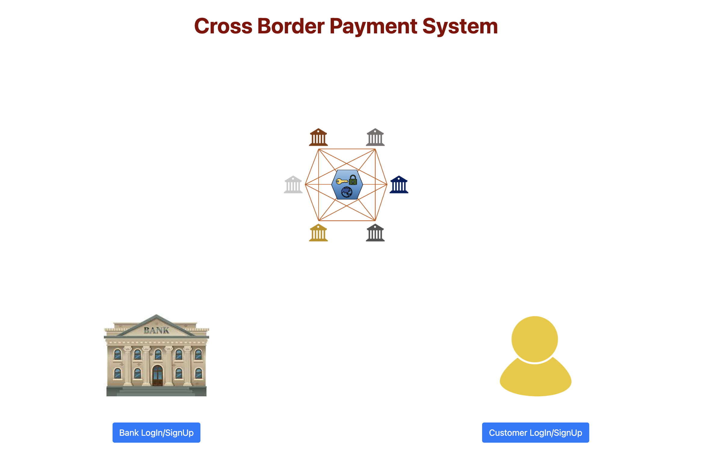
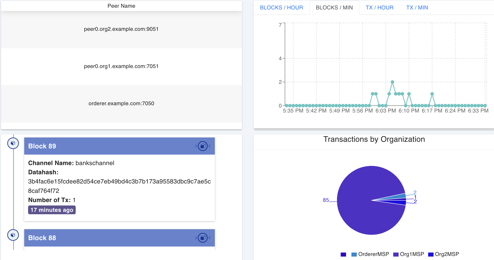

# Blockchain Based Cross Border Payment System

Cross-border payment is a term used to refer to a variety of transactions, such as the daily international transfer of money, between many businesses, government agencies, international organizations, merchants and individuals. These transactions are carried out in a complex network of intermediaries such as correspondent banks and clearing houses, which is called the traditional system today. The most important disadvantages of these systems are; transferring between too many intermediary banks in the transaction process reduces transparency, increases the transaction cost, and prolongs the transaction time.

## Project Description

Within the scope of this project, it is aimed to solve these problems with the perspective of creating an additional data layer by including the blockchain in the cross-border payment system. While doing this, a CA (Certificate Authority) is used for person and transaction verifications. Hyperledger Fabric, an open source blockchain framework for private and permissioned corporate networks, was used in the network infrastructure. Individuals, businesses, and financial service providers interact through this network to make, receive, and track payments using the interface. All transactions performed within the network are kept in distributed ledgers. Thus, transparency is ensured by eliminating intermediaries, transactions are accelerated and costs are reduced.

## Running the Application

### Requirements

Following are the software dependencies required to run this project

   - Hyperledger Fabric
   - Docker
   - Docker-Compose
   - Go
   - Nodejs 
   - Couchdb
   - Git
   - Curl
   - Other binaries needed to run on Windows or OS X.
   - Optionals: VS Code for editing the files

### Steps for Running the Project

1. Clone this repository to get the latest using the following command.

```bash
git clone 
```

2. Navigate to the `cbps-network` directory:

```bash
cd cbps-network
```

3. Run the following command to start the `cbps-network` and create a 'bankschanne':

```bash
./network.sh up createChannel -c bankschannel -ca -s couchdb0
```

4. Deploy the chaincode:

```bash
./network.sh deployCC -c bankschannel -ccn bank -ccp ../crossBorderPayment/chaincode-go/ -ccl go -ccep "OR('Org1MSP.peer','Org2MSP.peer')"
```

5. Navigate to the `crossBorderPayment/application` directory:

```bash
cd ../crossBorderPayment/application
```

6. Install npm if running the project for the first time:

```bash
npm install
```

7. Enroll the admin users:

```bash
node enrollAdmin.js org1
node enrollAdmin.js org2
```

8. Start the application by running the following command:

```bash
node app.js
```

If there are no errors, the Cross Border Payment System application will be accessible at `http://localhost:3000`:



### Hyperledger Explorer Configuration

Hyperledger Explorer is used to monitor, analyze, and interact with blockchain networks, providing real-time insights, transaction details, and smart contract interactions for administrators, developers, and users. This project includes Hyperledger Expolorer.

Follow the steps below to run Hyperledger Explorer:

1. Modify the necessary files for the explorer:

   - Take the name of the file in the `cbps-network/organizations/peerOrganizations/org1.example.com/users/Admin@org1.example.com/msp/keystore` directory.
   - Change the end of the `adminPrivateKey` value in the `explorer/cbps-network.json` file.

2. Navigate to the `explorer` directory:

```bash
cd explorer
```

3. Start the Docker containers:

```bash
docker-compose up
```

If there are no errors, the explorer interface will be accessible at `http://localhost:8080`:



### Stop and Clear Network

1. Navigate to the `cbps-network` directory:

```bash
cd ../cbps-network
```

2. Run the following command to shut down the network:

```bash
./network.sh down
```

3. Navigate to the `crossBorderPayment/application` directory:

```bash
cd ../crossBorderPayment/application
```

4. Delete the `wallet` and `node-modules` directories:

```bash
rm -rf wallet
rm -rf node-modules
```
```

Stopping and Removing Docker Containers:

```bash
docker stop $(docker ps -a -q)
docker rm -f $(docker ps -aq)
docker system prune -a
docker volume prune
```

Listing Docker Containers and Images:

```bash
docker ps -a
docker images -a
docker volume ls
```